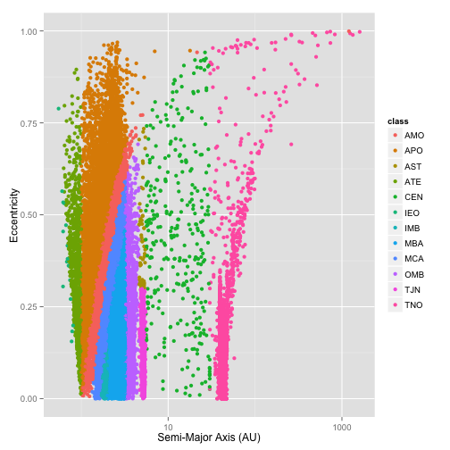
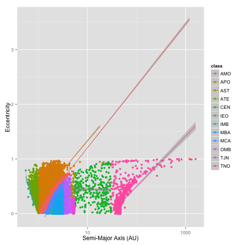
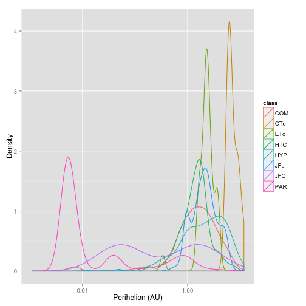

JPL Asteroid and Comet Data Explorer
========================================================
author: Michael Primm
date: 11/21/2015

JPL Small-Body Database
========================================================

The source data for our application, this is the definitive source for physical and orbital data on asteroids and comets.

- 698548 distinct asteroids included
- 3371 distinct comets included
- As many as 19 attributes from each object, including:
  - physical attributes like diameter, albedo, rotation period
  - orbital attributes like semi-major axis, perihelion, aphelion, inclination, eccetricity

Exploration of Attribute Relationships
========================================================

The tool allows for graphing of relationships between various physical and orbital attributes across a selected population of objects.  

For example, the relationship between semi-major axis and eccentricity for asteroids of different orbit classes:
 

Regression Modelling of Attribute Relationships
========================================================

Further, relationships can be modelled with linear or polynomial regression, overall or per orbit class:
 

Density and Histogram Presentation by Orbit Class
========================================================
Finally, population density and histograms can be presented for a single attribute across the selected object population.  For example, density across comets by perihelion distance:
 

